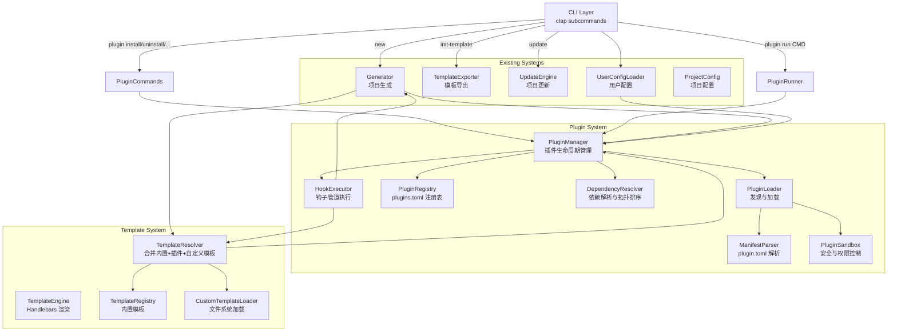
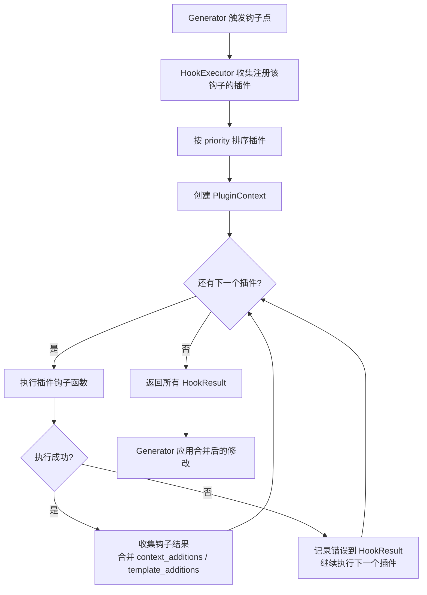
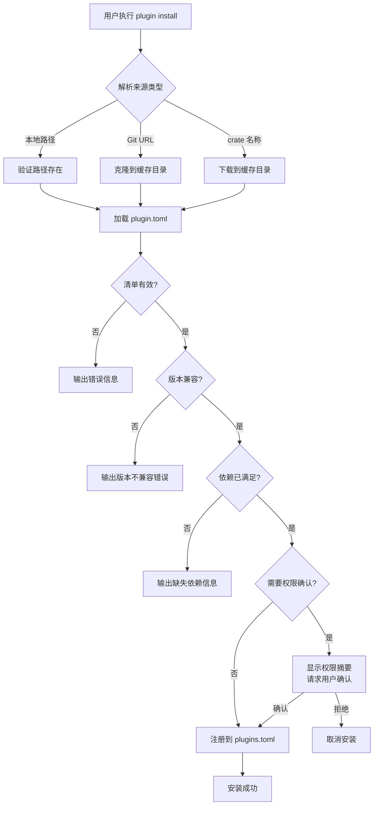
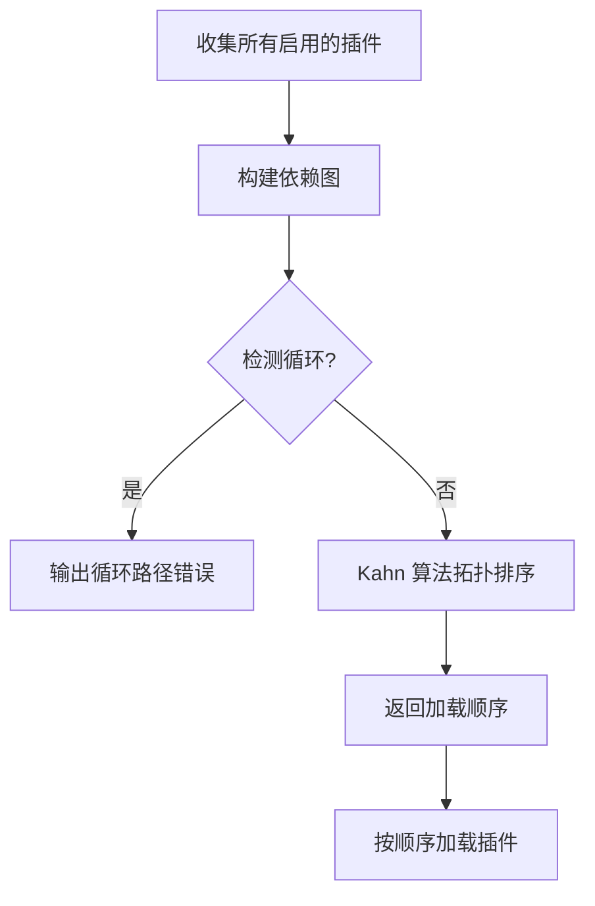
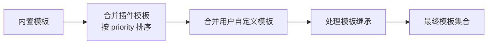

# 设计文档 / Design Document

## 概述 / Overview

v0.4.0 为 `axum-app-create` 引入插件系统（Plugin System），作为工具未来可扩展性的核心架构特性。设计目标是在保持现有架构不变的前提下，通过新增 `plugin` 模块实现插件的发现、加载、生命周期管理和钩子执行。

This design covers the Plugin System for v0.4.0, the core architectural feature for future extensibility. The design goal is to extend functionality by adding a new `plugin` module while keeping the existing architecture intact.

核心设计决策 / Key design decisions:
- 插件以目录形式存在，包含 `plugin.toml` 清单文件和可选的 `templates/` 目录
- 插件通过 Rust trait（`PluginHooks`）定义钩子接口，v0.4.0 使用基于脚本/配置的钩子实现（非动态链接）
- 插件注册表使用 TOML 文件（`~/.axum-app-create/plugins.toml`）持久化
- 插件加载按依赖拓扑排序，确保被依赖的插件先初始化
- 钩子执行采用管道模式（pipeline），按优先级顺序传递上下文
- 插件模板参与现有的 TemplateResolver 合并流程，优先级：用户自定义 > 插件 > 内置
- 插件命令注册在 `plugin run <COMMAND>` 命名空间下，避免与内置命令冲突
- 插件安全通过文件系统路径白名单和权限声明实现

## 架构 / Architecture



### 模块职责 / Module Responsibilities

| 模块 / Module | 职责 / Responsibility | 文件 / File |
|---|---|---|
| PluginManager | 插件生命周期管理：安装、卸载、启用、禁用、加载 | `src/plugin/manager.rs` |
| PluginLoader | 从各种来源发现和加载插件目录 | `src/plugin/loader.rs` |
| PluginRegistry | 读写 `~/.axum-app-create/plugins.toml` 注册表 | `src/plugin/registry.rs` |
| ManifestParser | 解析和验证 `plugin.toml` 清单文件 | `src/plugin/manifest.rs` |
| DependencyResolver | 解析插件依赖关系，检测循环，拓扑排序 | `src/plugin/dependency.rs` |
| HookExecutor | 按优先级执行插件钩子管道 | `src/plugin/hooks.rs` |
| PluginSandbox | 文件系统访问控制和权限验证 | `src/plugin/sandbox.rs` |


## 组件与接口 / Components and Interfaces

### 1. PluginManifest（插件清单）

```rust
/// 插件清单：描述插件的元数据和能力
/// Plugin manifest: describes plugin metadata and capabilities
#[derive(Debug, Clone, Serialize, Deserialize, PartialEq)]
pub struct PluginManifest {
    /// 插件名称（kebab-case）/ Plugin name
    pub name: String,
    /// 语义化版本 / Semantic version
    pub version: String,
    /// 插件描述 / Description
    pub description: String,
    /// 最低兼容的 CLI_Tool 版本 / Minimum compatible tool version
    pub min_tool_version: String,
    /// 作者（可选）/ Author (optional)
    pub author: Option<String>,
    /// 许可证（可选）/ License (optional)
    pub license: Option<String>,
    /// 仓库地址（可选）/ Repository URL (optional)
    pub repository: Option<String>,
    /// 主页（可选）/ Homepage (optional)
    pub homepage: Option<String>,
    /// 关键词（可选）/ Keywords (optional)
    pub keywords: Option<Vec<String>>,
    /// 能力声明 / Capability declarations
    pub capabilities: PluginCapabilities,
    /// 插件依赖 / Plugin dependencies
    #[serde(default)]
    pub dependencies: HashMap<String, String>,
    /// 插件配置定义 / Plugin config definitions
    #[serde(default)]
    pub config: HashMap<String, toml::Value>,
    /// 权限声明 / Permission declarations
    #[serde(default)]
    pub permissions: PluginPermissions,
    /// 钩子优先级（默认 100，越小越优先）/ Hook priority
    #[serde(default = "default_priority")]
    pub priority: u32,
}

fn default_priority() -> u32 { 100 }

/// 插件能力声明 / Plugin capability declarations
#[derive(Debug, Clone, Serialize, Deserialize, PartialEq, Default)]
pub struct PluginCapabilities {
    /// 是否提供模板集 / Provides template sets
    #[serde(default)]
    pub templates: bool,
    /// 钩子列表 / Hook list (e.g. ["pre_generate", "post_generate"])
    #[serde(default)]
    pub hooks: Vec<String>,
    /// 自定义命令列表 / Custom command list
    #[serde(default)]
    pub commands: Vec<PluginCommandDef>,
}

/// 插件命令定义 / Plugin command definition
#[derive(Debug, Clone, Serialize, Deserialize, PartialEq)]
pub struct PluginCommandDef {
    /// 命令名称 / Command name
    pub name: String,
    /// 命令描述 / Command description
    pub description: String,
    /// 命令执行的脚本路径（相对于插件目录）/ Script path relative to plugin dir
    pub script: String,
}

/// 插件权限声明 / Plugin permission declarations
#[derive(Debug, Clone, Serialize, Deserialize, PartialEq, Default)]
pub struct PluginPermissions {
    /// 网络访问 / Network access
    #[serde(default)]
    pub network: bool,
    /// 文件系统访问（超出项目目录）/ Filesystem access beyond project dir
    #[serde(default)]
    pub filesystem: bool,
    /// 执行外部命令 / Execute external commands
    #[serde(default)]
    pub exec: bool,
}
```

### 2. ManifestParser（清单解析器）

```rust
/// 插件清单解析器
/// Plugin manifest parser
pub struct ManifestParser;

impl ManifestParser {
    /// 从 TOML 字符串解析清单 / Parse manifest from TOML string
    pub fn parse(content: &str) -> Result<PluginManifest>;

    /// 将清单序列化为 TOML 字符串 / Serialize manifest to TOML string
    pub fn serialize(manifest: &PluginManifest) -> Result<String>;

    /// 验证清单必填字段 / Validate required fields
    pub fn validate(manifest: &PluginManifest) -> Result<()>;

    /// 从插件目录加载清单 / Load manifest from plugin directory
    pub fn load_from_dir(plugin_dir: &Path) -> Result<PluginManifest>;
}
```

### 3. PluginRegistry（插件注册表）

```rust
/// 已安装插件的注册信息 / Installed plugin registry entry
#[derive(Debug, Clone, Serialize, Deserialize, PartialEq)]
pub struct PluginEntry {
    /// 插件名称 / Plugin name
    pub name: String,
    /// 插件版本 / Plugin version
    pub version: String,
    /// 是否启用 / Enabled status
    pub enabled: bool,
    /// 插件来源 / Plugin source
    pub source: PluginSource,
    /// 本地安装路径 / Local installation path
    pub install_path: PathBuf,
    /// 安装时间 / Installation timestamp
    pub installed_at: String,
}

/// 插件来源 / Plugin source
#[derive(Debug, Clone, Serialize, Deserialize, PartialEq)]
#[serde(tag = "type")]
pub enum PluginSource {
    /// 本地路径 / Local path
    Local { path: PathBuf },
    /// Git 仓库 / Git repository
    Git { url: String, rev: Option<String> },
    /// crates.io / crates.io crate
    Crate { name: String, version: String },
}

/// 插件注册表 / Plugin registry
#[derive(Debug, Clone, Serialize, Deserialize, PartialEq, Default)]
pub struct PluginRegistry {
    /// 已安装的插件列表 / Installed plugins
    #[serde(default)]
    pub plugins: Vec<PluginEntry>,
}

impl PluginRegistry {
    /// 从 ~/.axum-app-create/plugins.toml 加载注册表
    pub fn load() -> Result<Self>;

    /// 保存注册表到 ~/.axum-app-create/plugins.toml
    pub fn save(&self) -> Result<()>;

    /// 添加插件条目 / Add plugin entry
    pub fn add(&mut self, entry: PluginEntry);

    /// 移除插件条目 / Remove plugin entry
    pub fn remove(&mut self, name: &str) -> Option<PluginEntry>;

    /// 查找插件 / Find plugin by name
    pub fn find(&self, name: &str) -> Option<&PluginEntry>;

    /// 查找插件（可变引用）/ Find plugin by name (mutable)
    pub fn find_mut(&mut self, name: &str) -> Option<&mut PluginEntry>;

    /// 获取所有启用的插件 / Get all enabled plugins
    pub fn enabled_plugins(&self) -> Vec<&PluginEntry>;
}
```

### 4. PluginLoader（插件加载器）

```rust
/// 插件加载器：从各种来源发现和加载插件
/// Plugin loader: discover and load plugins from various sources
pub struct PluginLoader {
    cache_dir: PathBuf,  // ~/.axum-app-create/plugins/
}

impl PluginLoader {
    pub fn new() -> Result<Self>;

    /// 从来源安装插件到缓存目录 / Install plugin from source to cache
    pub fn install(&self, source: &PluginSource) -> Result<PathBuf>;

    /// 从本地路径加载插件 / Load plugin from local path
    pub fn load_local(&self, path: &Path) -> Result<LoadedPlugin>;

    /// 从 Git 仓库克隆插件 / Clone plugin from Git repository
    pub fn load_git(&self, url: &str, rev: Option<&str>) -> Result<LoadedPlugin>;

    /// 从 crates.io 下载插件 / Download plugin from crates.io
    pub fn load_crate(&self, name: &str, version: &str) -> Result<LoadedPlugin>;

    /// 验证版本兼容性 / Validate version compatibility
    pub fn check_compatibility(manifest: &PluginManifest) -> Result<()>;
}

/// 已加载的插件 / A loaded plugin ready for use
pub struct LoadedPlugin {
    pub manifest: PluginManifest,
    pub dir: PathBuf,
    pub templates: HashMap<String, String>,
}
```

### 5. DependencyResolver（依赖解析器）

```rust
/// 插件依赖解析器
/// Plugin dependency resolver
pub struct DependencyResolver;

impl DependencyResolver {
    /// 解析依赖并返回拓扑排序后的加载顺序
    /// Resolve dependencies and return topologically sorted load order
    /// Returns: Vec<plugin_name> in load order (dependencies first)
    pub fn resolve(
        plugins: &HashMap<String, PluginManifest>,
    ) -> Result<Vec<String>>;

    /// 检测循环依赖 / Detect circular dependencies
    /// Returns: Some(cycle_path) if cycle found, None otherwise
    pub fn detect_cycle(
        plugins: &HashMap<String, PluginManifest>,
    ) -> Option<Vec<String>>;

    /// 验证所有依赖已安装且版本兼容
    /// Validate all dependencies are installed and version-compatible
    pub fn validate_dependencies(
        plugin: &PluginManifest,
        installed: &HashMap<String, PluginManifest>,
    ) -> Result<()>;
}
```

### 6. HookExecutor（钩子执行器）

```rust
/// 钩子类型 / Hook types
#[derive(Debug, Clone, PartialEq, Eq, Hash)]
pub enum HookPoint {
    PreGenerate,
    PostGenerate,
    ModifyContext,
    ModifyTemplates,
}

/// 钩子执行上下文 / Hook execution context
pub struct PluginContext {
    pub tool_version: String,
    pub project_config: ProjectConfig,
    pub project_dir: PathBuf,
    pub plugin_config: toml::Value,
    pub plugin_dir: PathBuf,
}

/// 钩子执行结果 / Hook execution result
pub struct HookResult {
    pub plugin_name: String,
    pub success: bool,
    pub error: Option<String>,
    /// 修改后的模板上下文变量 / Modified template context variables
    pub context_additions: HashMap<String, serde_json::Value>,
    /// 修改后的模板集合 / Modified template set
    pub template_additions: HashMap<String, String>,
}

/// 钩子执行器 / Hook executor
pub struct HookExecutor;

impl HookExecutor {
    /// 执行指定钩子点的所有插件钩子（按优先级排序）
    /// Execute all plugin hooks for a given hook point (sorted by priority)
    pub fn execute(
        hook: HookPoint,
        plugins: &[LoadedPlugin],
        context: &mut PluginContext,
    ) -> Vec<HookResult>;

    /// 按优先级排序插件 / Sort plugins by priority
    pub fn sort_by_priority(plugins: &[LoadedPlugin]) -> Vec<&LoadedPlugin>;
}
```

### 7. PluginSandbox（安全沙箱）

```rust
/// 插件安全沙箱 / Plugin security sandbox
pub struct PluginSandbox;

impl PluginSandbox {
    /// 验证路径是否在允许范围内 / Validate path is within allowed scope
    pub fn validate_path(
        path: &Path,
        project_dir: &Path,
        plugin_dir: &Path,
    ) -> Result<()>;

    /// 验证插件权限 / Validate plugin permissions
    pub fn check_permissions(
        manifest: &PluginManifest,
        action: &str,
    ) -> Result<()>;

    /// 显示权限摘要并请求用户确认 / Display permission summary and request confirmation
    pub fn confirm_permissions(
        manifest: &PluginManifest,
        interactive: bool,
    ) -> Result<bool>;
}
```

### 8. PluginManager（插件管理器 — 门面）

```rust
/// 插件管理器：统一的插件操作入口
/// Plugin manager: unified entry point for plugin operations
pub struct PluginManager {
    registry: PluginRegistry,
    loader: PluginLoader,
    loaded_plugins: Vec<LoadedPlugin>,
}

impl PluginManager {
    /// 初始化插件管理器 / Initialize plugin manager
    pub fn new() -> Result<Self>;

    /// 安装插件 / Install plugin
    pub fn install(&mut self, source: PluginSource, interactive: bool) -> Result<()>;

    /// 卸载插件 / Uninstall plugin
    pub fn uninstall(&mut self, name: &str, interactive: bool) -> Result<()>;

    /// 启用插件 / Enable plugin
    pub fn enable(&mut self, name: &str) -> Result<()>;

    /// 禁用插件 / Disable plugin
    pub fn disable(&mut self, name: &str) -> Result<()>;

    /// 列出所有插件 / List all plugins
    pub fn list(&self) -> &[PluginEntry];

    /// 获取插件详情 / Get plugin details
    pub fn info(&self, name: &str) -> Result<&PluginEntry>;

    /// 加载所有启用的插件（按依赖拓扑排序）
    /// Load all enabled plugins (topologically sorted by dependencies)
    pub fn load_enabled(&mut self) -> Result<()>;

    /// 获取所有插件模板 / Get all plugin templates
    pub fn get_plugin_templates(&self) -> HashMap<String, String>;

    /// 执行钩子 / Execute hooks
    pub fn execute_hook(
        &self,
        hook: HookPoint,
        context: &mut PluginContext,
    ) -> Vec<HookResult>;

    /// 运行插件命令 / Run plugin command
    pub fn run_command(
        &self,
        plugin_name: &str,
        command_name: &str,
        args: &[String],
    ) -> Result<()>;
}
```

### 9. CLI 子命令扩展 / CLI Subcommand Extension

```rust
#[derive(Subcommand, Debug)]
enum Commands {
    // ... 现有子命令保持不变 ...
    New { /* ... */ },
    InitTemplate { /* ... */ },
    Update { /* ... */ },

    /// 插件管理 / Plugin management
    Plugin {
        #[command(subcommand)]
        action: PluginAction,
    },
}

#[derive(Subcommand, Debug)]
enum PluginAction {
    /// 安装插件 / Install a plugin
    Install {
        /// 插件来源 / Plugin source (path, git URL, or crate name)
        source: String,
        /// 从 Git 仓库安装 / Install from Git repository
        #[arg(long)]
        git: Option<String>,
        /// 从本地路径安装 / Install from local path
        #[arg(long)]
        path: Option<PathBuf>,
    },
    /// 卸载插件 / Uninstall a plugin
    Uninstall {
        /// 插件名称 / Plugin name
        name: String,
    },
    /// 启用插件 / Enable a plugin
    Enable {
        name: String,
    },
    /// 禁用插件 / Disable a plugin
    Disable {
        name: String,
    },
    /// 列出已安装插件 / List installed plugins
    List,
    /// 显示插件详情 / Show plugin details
    Info {
        name: String,
    },
    /// 运行插件命令 / Run a plugin command
    Run {
        /// 命令名称 / Command name
        command: String,
        /// 命令参数 / Command arguments
        #[arg(trailing_var_arg = true)]
        args: Vec<String>,
    },
}
```


## 数据模型 / Data Models

### PluginManifest（`plugin.toml`）

```toml
# 插件清单示例 / Example plugin manifest
name = "axum-graphql"
version = "0.1.0"
description = "Add GraphQL support to Axum projects"
min_tool_version = "0.4.0"
author = "Community"
license = "MIT"
repository = "https://github.com/example/axum-graphql-plugin"
keywords = ["graphql", "async-graphql"]
priority = 50

[capabilities]
templates = true
hooks = ["post_generate", "modify_context"]

[[capabilities.commands]]
name = "gen-schema"
description = "Generate GraphQL schema from Rust types"
script = "scripts/gen-schema.sh"

[dependencies]
# 依赖其他插件 / Depends on other plugins
# axum-database = ">=0.1.0"

[config]
# 插件配置定义及默认值 / Plugin config definitions with defaults
schema_path = "src/graphql/schema.rs"
playground = true

[permissions]
network = false
filesystem = false
exec = true
```

### PluginRegistry（`~/.axum-app-create/plugins.toml`）

```toml
# 插件注册表 / Plugin registry

[[plugins]]
name = "axum-graphql"
version = "0.1.0"
enabled = true
installed_at = "2025-07-15T10:30:00Z"

[plugins.source]
type = "Git"
url = "https://github.com/example/axum-graphql-plugin"

[[plugins]]
name = "company-standards"
version = "1.0.0"
enabled = true
installed_at = "2025-07-14T08:00:00Z"

[plugins.source]
type = "Local"
path = "/home/user/plugins/company-standards"
```

### UserConfig 扩展（`~/.axum-app-create.toml`）

```toml
# 现有配置 / Existing config
template_dir = "/home/user/.axum-templates"

# 插件配置 / Plugin configuration
[plugins.axum-graphql]
schema_path = "src/gql/schema.rs"
playground = false

[plugins.company-standards]
team = "backend"
```

### 插件目录结构 / Plugin Directory Structure

```
my-plugin/
├── plugin.toml          # 插件清单（必需）
├── templates/           # 模板文件（可选，当 capabilities.templates = true）
│   ├── src/
│   │   └── graphql.rs.hbs
│   └── Cargo.toml.hbs  # 可使用 extends 继承内置模板
└── scripts/             # 命令脚本（可选，当 capabilities.commands 非空）
    └── gen-schema.sh
```

### 钩子执行流程 / Hook Execution Flow



### 插件安装流程 / Plugin Installation Flow



### 依赖拓扑排序 / Dependency Topological Sort



### TemplateResolver 扩展 / TemplateResolver Extension

模板合并优先级（从高到低）/ Template merge priority (highest to lowest):
1. 用户自定义模板（`--template-dir`）/ User custom templates
2. 插件模板（按 priority 排序，数值小的优先）/ Plugin templates (sorted by priority)
3. 内置模板 / Built-in templates



### 新增依赖 / New Dependencies

| Crate | 版本 / Version | 用途 / Purpose |
|---|---|---|
| `semver` | `1` | 语义化版本解析和比较 |
| `git2` | (已有 / existing) | Git 仓库克隆（插件安装） |

注：`toml`、`serde`、`serde_json`、`dirs` 等已在 v0.3.0 中引入，无需新增。


## 正确性属性 / Correctness Properties

*正确性属性是在系统所有有效执行中都应成立的特征或行为——本质上是关于系统应该做什么的形式化陈述。属性作为人类可读规范与机器可验证正确性保证之间的桥梁。*

*A property is a characteristic or behavior that should hold true across all valid executions of a system — essentially, a formal statement about what the system should do. Properties serve as the bridge between human-readable specifications and machine-verifiable correctness guarantees.*

### Acceptance Criteria Testing Prework

**Requirement 1: Plugin Manifest and Metadata**
- 1.1 TOML format definition → no (structural requirement)
- 1.2 Required fields → yes - property (validate across random manifests)
- 1.3 Optional fields → no (structural requirement)
- 1.4 Capabilities section → no (structural requirement)
- 1.5 Missing required fields error → yes - property (generate manifests with missing fields)
- 1.6 Dependencies section → no (structural requirement)
- 1.7 Parse manifest → yes - property (parse random valid TOML)
- 1.8 Serialize manifest → yes - property (serialize random manifests)
- 1.9 Round-trip serialization → yes - property (serialize then deserialize)

**Requirement 2: Plugin Discovery and Loading**
- 2.1-2.3 Source loading → no (I/O integration, not unit-testable as property)
- 2.4 Validate local path → yes - example (specific path scenarios)
- 2.5 Clone to cache → no (I/O integration)
- 2.6 Source unreachable error → yes - example (specific error scenarios)
- 2.7 Version compatibility check → yes - property (generate random version pairs)
- 2.8 Version incompatible error → edge-case (covered by 2.7)
- 2.9 Cache directory → no (I/O integration)

**Requirement 3: Plugin Lifecycle Management**
- 3.1-3.6 CLI commands → no (CLI integration, not unit-testable)
- 3.7 Registry persistence → yes - property (add then find)
- 3.8 Uninstall removes from registry → yes - property (add then remove then find)
- 3.9 Dependency warning on uninstall → yes - property (generate dependency graphs)
- 3.10 Registry serialization round-trip → yes - property (serialize then deserialize)

**Requirement 4: Plugin API and Hook System**
- 4.1 Hook point definitions → no (structural requirement)
- 4.2 pre_generate hook execution → yes - property (execute with random plugins)
- 4.3 post_generate hook execution → combined with 4.2
- 4.4 modify_context adds but doesn't remove → yes - property (verify context invariant)
- 4.5 modify_templates adds/replaces → yes - property (verify template set changes)
- 4.6 Trait definition → no (structural requirement)
- 4.7 Priority ordering → yes - property (generate random priorities, verify order)
- 4.8 Error doesn't interrupt pipeline → yes - property (inject errors, verify continuation)
- 4.9 PluginContext structure → no (structural requirement)

**Requirement 5: Plugin-Provided Template Sets**
- 5.1 Load from templates/ dir → no (I/O integration)
- 5.2 Template merge priority → yes - property (generate multi-source templates, verify priority)
- 5.3 Multiple plugins same path → yes - property (covered by 5.2 with priority)
- 5.4 Plugin templates in inheritance → no (integration test)
- 5.5 Extends directive with built-in → no (integration test)
- 5.6 Validate Handlebars syntax → no (integration test)

**Requirement 6: Plugin Custom Commands**
- 6.1-6.5 Command registration and execution → no (CLI integration)

**Requirement 7: Plugin Configuration**
- 7.1 UserConfig plugin sections → yes - property (parse random plugin configs)
- 7.2 Manifest config definitions → no (structural requirement)
- 7.3 Config merge (default + user override) → yes - property (generate random configs, verify merge)
- 7.4 Unknown config key warning → yes - property (generate configs with unknown keys)
- 7.5 Config passed to hooks → no (integration test)

**Requirement 8: Plugin Dependency Resolution**
- 8.1 Dependency validation → yes - property (generate random dependency graphs)
- 8.2 Missing dependency error → edge-case (covered by 8.1)
- 8.3 Circular dependency detection → yes - property (generate graphs with/without cycles)
- 8.4 Topological sort order → yes - property (verify dependencies loaded before dependents)
- 8.5 Version conflict error → edge-case (covered by 8.1)

**Requirement 9: CLI Arguments Extension**
- 9.1-9.7 CLI structure → no (CLI integration)

**Requirement 10: Backward Compatibility**
- 10.1 No plugins = v0.3.0 behavior → yes - property (generate projects, compare output)
- 10.2 v0.3.0 CLI args work → no (integration test)
- 10.3 Existing tests pass → no (test suite verification)
- 10.4 Plugin system failure = graceful degradation → yes - example

**Requirement 11: Plugin Security and Trust Model**
- 11.1 First install confirmation → no (interactive UI)
- 11.2 Filesystem access restriction → yes - property (generate random paths, verify access control)
- 11.3 Restricted path rejection → edge-case (covered by 11.2)
- 11.4 Permissions section → no (structural requirement)
- 11.5 Permission confirmation → no (interactive UI)

### Property Reflection

After reviewing all testable properties, consolidating redundant ones:
- 1.5 (missing fields error) is subsumed by 1.9 (round-trip) since invalid manifests won't round-trip
- 1.7 and 1.8 are both subsumed by 1.9 (round-trip covers parse + serialize)
- 4.2 and 4.3 (pre/post generate hooks) can be combined into one priority ordering property
- 5.2 and 5.3 (template priority) are the same property
- 3.7 and 3.8 (registry add/remove) can be combined into one registry invariant property
- 7.1 and 7.3 (plugin config parsing and merge) can be combined
- 8.1, 8.3, 8.4 (dependency resolution) — 8.3 (cycle detection) is distinct; 8.1 and 8.4 can be combined

Final consolidated properties:

### Property 1: 插件清单序列化往返 / Plugin manifest serialization round-trip

*For any* valid `PluginManifest` struct, serializing to TOML and then deserializing back SHALL produce an equivalent struct.

**Validates: Requirements 1.7, 1.8, 1.9**

### Property 2: 插件清单必填字段验证 / Plugin manifest required field validation

*For any* TOML string that is missing one or more of the required fields (`name`, `version`, `description`, `min_tool_version`), parsing SHALL return an error indicating the missing field(s).

**Validates: Requirements 1.2, 1.5**

### Property 3: 版本兼容性检查 / Version compatibility check

*For any* pair of semantic versions (plugin's `min_tool_version` and current tool version), the compatibility check SHALL return Ok when the tool version is greater than or equal to the minimum, and Err otherwise.

**Validates: Requirements 2.7, 2.8**

### Property 4: 插件注册表往返与不变量 / Plugin registry round-trip and invariants

*For any* sequence of add and remove operations on a `PluginRegistry`, (a) serializing to TOML and deserializing back SHALL produce an equivalent registry, and (b) after adding a plugin, `find(name)` SHALL return that plugin; after removing it, `find(name)` SHALL return None.

**Validates: Requirements 3.7, 3.8, 3.10**

### Property 5: 卸载依赖检测 / Uninstall dependency detection

*For any* set of installed plugins with dependency relationships, attempting to uninstall a plugin that is depended upon by other enabled plugins SHALL be detected and reported.

**Validates: Requirements 3.9**

### Property 6: 钩子优先级排序 / Hook priority ordering

*For any* set of loaded plugins with distinct priority values, the hook executor SHALL invoke them in ascending priority order (lower number = higher priority).

**Validates: Requirements 4.2, 4.3, 4.7**

### Property 7: modify_context 只添加不删除 / modify_context only adds, never removes

*For any* initial TemplateContext and *any* set of plugin context additions, the resulting context SHALL contain all original variables plus the additions. No original variable SHALL be removed or modified.

**Validates: Requirements 4.4**

### Property 8: 钩子错误不中断管道 / Hook errors do not interrupt pipeline

*For any* set of plugins where some return errors during hook execution, the executor SHALL still invoke all remaining plugins and return results for every plugin.

**Validates: Requirements 4.8**

### Property 9: 模板合并优先级 / Template merge priority

*For any* set of built-in templates, plugin templates (from multiple plugins with different priorities), and user custom templates, the resolved template set SHALL use: user custom > higher-priority plugin > lower-priority plugin > built-in, for each template path.

**Validates: Requirements 5.2, 5.3**

### Property 10: 插件配置合并 / Plugin configuration merge

*For any* plugin manifest config defaults and *any* user config overrides, the merged config SHALL contain user values for overridden keys and manifest defaults for non-overridden keys.

**Validates: Requirements 7.1, 7.3**

### Property 11: 循环依赖检测 / Circular dependency detection

*For any* set of plugins whose dependency graph contains a cycle, `detect_cycle` SHALL return `Some` with the cycle path. *For any* acyclic dependency graph, `detect_cycle` SHALL return `None`.

**Validates: Requirements 8.3**

### Property 12: 依赖拓扑排序正确性 / Dependency topological sort correctness

*For any* acyclic set of plugins with dependencies, the resolved load order SHALL ensure that every plugin appears after all of its dependencies in the ordering.

**Validates: Requirements 8.1, 8.4**

### Property 13: 文件系统沙箱路径验证 / Filesystem sandbox path validation

*For any* path, `validate_path` SHALL return Ok only when the path is within the project directory or the plugin's own cache directory. All other paths SHALL be rejected.

**Validates: Requirements 11.2, 11.3**

### Property 14: 无插件时向后兼容 / Backward compatibility with no plugins

*For any* `ProjectConfig`, generating a project with an empty plugin set SHALL produce identical output to generating without the plugin system (v0.3.0 behavior).

**Validates: Requirements 10.1**


## 错误处理 / Error Handling

| 场景 / Scenario | 处理方式 / Handling | 错误类型 / Error Type |
|---|---|---|
| `plugin.toml` 缺少必填字段 | 输出缺失字段名称，拒绝加载 | `CliError::Config` |
| `plugin.toml` TOML 语法无效 | 输出解析错误详情 | `CliError::Config` |
| 插件本地路径不存在 | 输出路径信息，退出码 1 | `CliError::Config` |
| Git 克隆失败 | 输出 URL 和错误详情 | `CliError::Git` |
| crates.io 下载失败 | 输出 crate 名称和错误详情 | `CliError::Config` |
| 插件版本不兼容 | 输出要求版本和当前版本 | `CliError::Config` |
| 插件依赖未安装 | 输出缺失依赖名称和版本要求 | `CliError::Config` |
| 循环依赖检测 | 输出循环路径 | `CliError::Config` |
| 钩子执行错误 | 记录错误，继续执行后续插件 | Warning (non-fatal) |
| 插件命令执行失败 | 输出插件名称和命令名称 | `CliError::Generation` |
| 插件访问受限路径 | 拒绝操作，记录安全违规 | `CliError::Config` |
| 插件注册表文件损坏 | 输出警告，使用空注册表继续 | Warning (non-fatal) |
| 插件缓存目录不可写 | 输出警告，以无插件模式继续 | Warning (non-fatal) |
| 用户配置中未知插件配置键 | 输出警告，忽略未知键 | Warning (non-fatal) |

所有用户可见的错误信息必须为双语格式（英文 + 中文），与现有错误处理风格一致。

新增错误变体 / New error variants:
```rust
// 在 CliError 中新增 / Add to CliError
#[error("Plugin error: {0}")]
Plugin(String),
```

## 测试策略 / Testing Strategy

### 属性测试 / Property-Based Testing

使用 `proptest` crate 实现属性测试，每个属性测试至少运行 100 次迭代。

| Property | 测试方法 / Test Approach |
|---|---|
| Property 1 | 生成随机 PluginManifest（随机名称、版本、能力），序列化为 TOML 再反序列化，验证等价 |
| Property 2 | 生成缺少不同必填字段组合的 TOML 字符串，验证解析返回正确错误 |
| Property 3 | 生成随机语义化版本对，验证兼容性判断正确 |
| Property 4 | 生成随机的 add/remove 操作序列，验证注册表状态一致性和序列化往返 |
| Property 5 | 生成随机依赖图，尝试卸载被依赖的插件，验证检测到依赖关系 |
| Property 6 | 生成随机优先级的插件集合，验证钩子执行顺序 |
| Property 7 | 生成随机初始上下文和插件添加，验证原始变量保留 |
| Property 8 | 生成随机插件集合（部分返回错误），验证所有插件都被调用 |
| Property 9 | 生成随机的多层模板集合（内置、多插件、用户），验证合并优先级 |
| Property 10 | 生成随机的清单默认值和用户覆盖值，验证合并结果 |
| Property 11 | 生成随机有向图（含/不含循环），验证循环检测正确性 |
| Property 12 | 生成随机 DAG，验证拓扑排序中每个插件在其依赖之后 |
| Property 13 | 生成随机路径，验证沙箱路径验证正确性 |
| Property 14 | 使用多种 ProjectConfig 生成项目（空插件集），比较与无插件系统的输出 |

### 单元测试 / Unit Tests

- `ManifestParser::parse` — 各种格式的 plugin.toml（有效、无效、缺失字段）
- `ManifestParser::validate` — 必填字段验证
- `PluginRegistry::add/remove/find` — 注册表 CRUD 操作
- `DependencyResolver::resolve` — 简单依赖链、菱形依赖、无依赖
- `DependencyResolver::detect_cycle` — 直接循环、间接循环、无循环
- `HookExecutor::sort_by_priority` — 优先级排序
- `PluginSandbox::validate_path` — 项目目录内、插件目录内、外部路径
- `PluginLoader::check_compatibility` — 版本兼容和不兼容场景
- Plugin config merge — 默认值、覆盖值、未知键

### 集成测试 / Integration Tests

- 安装本地路径插件，验证注册表更新
- 安装带模板的插件，生成项目，验证插件模板出现在输出中
- 安装带钩子的插件，生成项目，验证钩子被执行
- 安装多个插件（有依赖关系），验证加载顺序
- 禁用插件后生成项目，验证插件不生效
- 卸载插件，验证注册表和文件清理
- 向后兼容：无插件时所有 v0.3.0 测试继续通过
- 插件系统初始化失败时的优雅降级

### 测试配置 / Test Configuration

- 属性测试库 / PBT library: `proptest` (已在项目中使用)
- 每个属性测试最少 100 次迭代 / Minimum 100 iterations per property test
- 每个属性测试必须引用设计文档中的属性编号 / Each test must reference design property number
- 标签格式 / Tag format: `Feature: v040-plugin-system, Property N: <property_text>`
